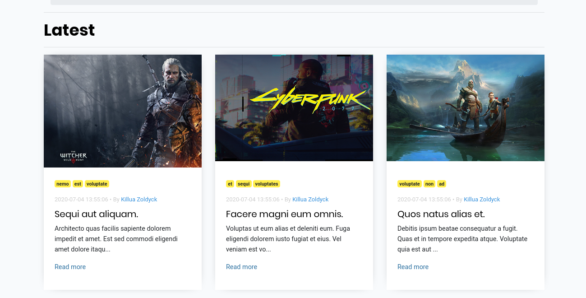
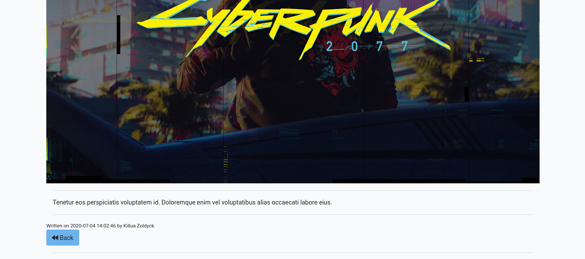
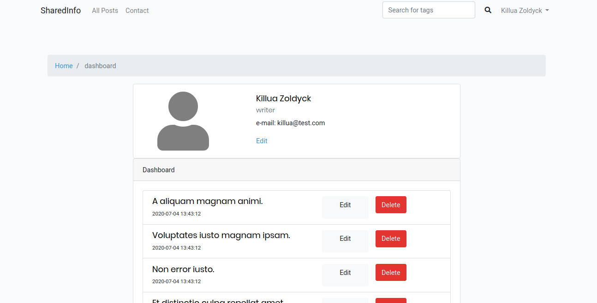

# Laravel Web Project (Blog)

## Table of Contents

-   [Laravel Web Project (Blog)](#laravel-web-project-blog)
    -   [Table of Contents](#table-of-contents)
    -   [About](#about)
    -   [UI](#ui)
        -   [Header](#header)
        -   [All Posts](#all-posts)
        -   [Single Post](#single-post)
        -   [Dashboard](#dashboard)
    -   [Key Parts](#key-parts)
    -   [Getting Started <a name = "getting_started"></a>](#getting-started) - [routes/web.php](#routeswebphp)

## About

A simple site to post blogs or articles done as a web project (PHP development) . It is powered by the Laravel Framework

## UI

### Header


### All Posts



### Single Post




### Dashboard



## Key Parts

-   Login / register
-   Role Specific actions
    -   User management (for admin)
    -   Post management (for writers)
    -   Discovering Posts (for readers and guests)
    -   Following writers (for readers)
-   Interesting Code Stuff
    -   route protection (using middleware)
    -   breadcrumbs (javascript on the front end)
    -   populating the database using : model factory , db:seed and faker

## Getting Started <a name = "getting_started"></a>

To test this on your machine do the following

-   add a mySQL database called lapp
-   in the project run
    <br>

```bash
	php artisan migrate
	php artisan db:seed
	php artisan serve
```

-   navigate to localhost:8000
-   😁

### routes/web.php

```php
Route::get('/', 'PagesController@Index');
//posts
Route::resource('posts', 'PostsController');
Route::post('posts/tags', 'PostsController@indexTag');
//users
Route::post('/users/follow', 'UsersController@follow');
Route::resource('users', 'UsersController');
Route::get('/users/{user}/admin', 'UsersController@toggleAdmin');
//auth
Auth::routes();
//dashboard
Route::get('/dashboard', 'DashboardController@index')->name('Dashboard');
//contact
Route::get('/contact', 'PagesController@contactShow');
Route::post('/contact', 'PagesController@contact');
```
